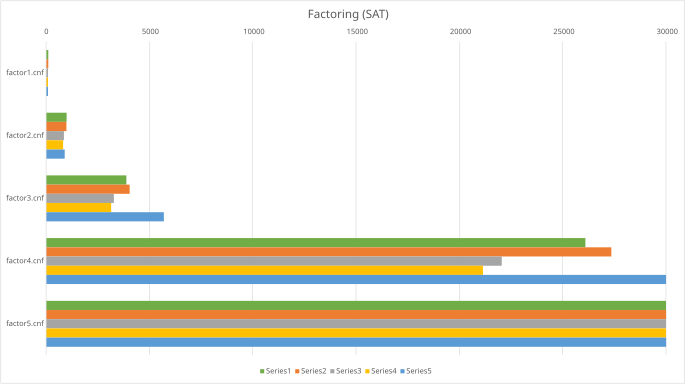
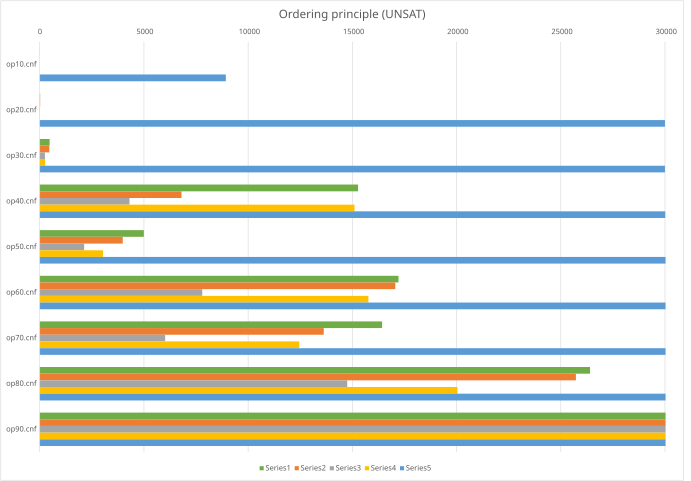
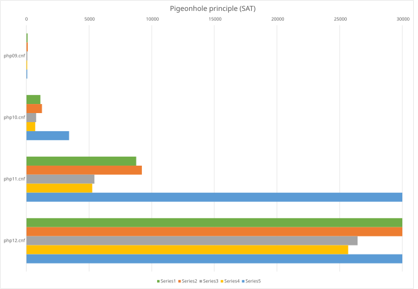
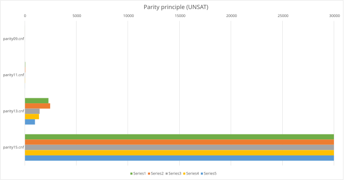
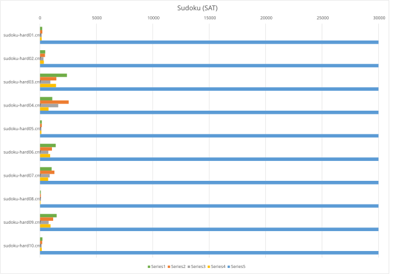
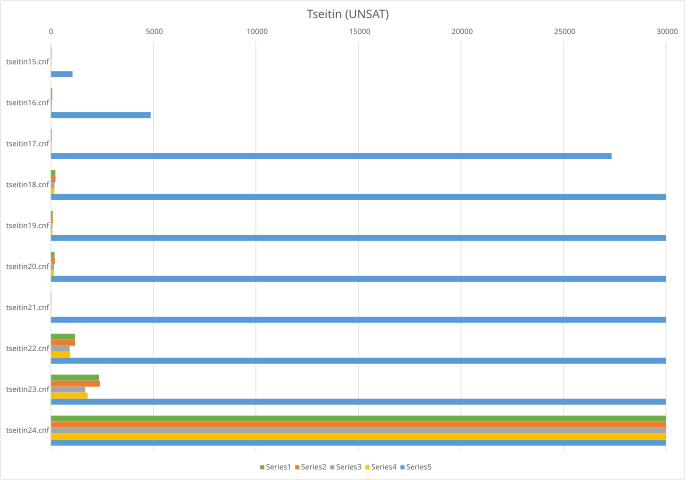

# Testing document

## Code coverage report

The full code coverage report is available in GitHub Pages:

https://aromppainen.github.io/sat-solver/coverage-report/

## What is tested

### Integration test cases

The solver is tested with a suite of integration test cases.

For each satisfiable formula in the test suite, it is asserted that

- the solver returns a `SATISFIABLE` status
- the truth assignment contains the same number of variables as the formula
- the formula is really satisfied, i.e. the truth assignment τ contains at least one literal l per clause such that τ(l) = TRUE.

For each unsatisfiable formula in the test suite, it is asserted that

- the solver returns an `UNSATISFIABLE` status

The test suite is copied directly from [kissat](https://github.com/arminbiere/kissat/tree/master/test/cnf). It contains many different categories of SAT problems. Here's a non-comprehensive list of descriptions

| Formula                             | Description                                                                                  |
| ----------------------------------- | -------------------------------------------------------------------------------------------- |
| `add4.cnf`, `add8.cnf`, ...         | Addition circuits, the number indicates bit-width.                                           |
| `and1.cnf`, `and2.cnf`, ...         | AND-gate encodings                                                                           |
| `congr1.cnf`, `congr2.cnf`, ...     | Modular arithmetic conditions                                                                |
| `diamond1.cnf`, `diamond2.cnf`, ... | Problems related to a type of graph circuit.                                                 |
| `eq1.cnf`, `eq2.cnf`, ...           | Simple equality constraints between boolean expressions.                                     |
| `factor1.cnf`, `factor2.cnf`, ...   | Factorization problems                                                                       |
| `false.cnf`                         | A trivial formula which is unsatisfiable.                                                    |
| `full2.cnf`, `full3.cnf`, ...       | 'full' boolean constraints, corresponding to full-adder or complete combinational circuits.  |
| `ite0.cnf`, `ite1.cnf`, ...         | if-then-else constraints                                                                     |
| `miter1.cnf`                        | This is a miter circuit, which are used to encode equivalence checking between two circuits. |
| `ph1.cnf`, `pn2.cnf`, ...           | Pigeonhole-principle formulas                                                                |
| `prime4.cnf`, `prime9.cnf`, ...     | Primality checks for integers                                                                |
| `sqrt2809.cnf`, `sqrt3481.cnf`, ... | Square root relations. The values used are perfect squares.                                  |
| `true.cnf`                          | A trivial formula which is satisfiable.                                                      |
| `xor1.cnf`, `xor2.cnf`, ...         | XOR-constraints                                                                              |

### Unit test cases

The following classes and methods are unit tested:

`MaxHeap` class:

- The heap invariant is enforced when
  - the heap is initialized with pre-filled values
  - an empty heap is initialized
  - the `Push` and `Pop` method are called
- The parameterized comparison method is used
- The heap is reordered when `UpHeap` and `DownHeap` methods are called

`PartialAssignment` class:

- The `Count` property returns a correct value after adding literals to the decision trail
- The `Count` property returns a correct value after backjumping
- `Backjump` method call calls `Undo` method of the assigned `IUndo` object with correct arguments
- `IsAssigned` method call returns a correct value based on the given literal parameter
- `IsUnassigned` method call returns a correct value based in the given variable parameter
- `AnalyzeConflict` method call returns a correct learned clause and decision level
- `ToList` method call returns a sorted list

`DimacsParser` class:

- The clauses are parsed correctly when the input data contains empty rows
- Error cases
  - input is empty
  - input is white space
  - missing problem line
  - invalid problem line
  - missing value line
  - invalid value line


## Code coverage report generation

The coverage report is generated using [ReportGenerator](https://github.com/danielpalme/ReportGenerator) tool.

```
dotnet tool install --global dotnet-reportgenerator-globaltool
```

If you are working on a Linux system, the dotnet tools directory needs to be added to the `PATH` environment variable.

```sh
export PATH="$HOME/.dotnet/tools:$PATH"
```

Because the program uses conditional compilation, the full report is a combined report of multiple test runs. Here is a full list of commands needed for generating the report (Windows):

```
dotnet build

tests\SatSolver.Dimacs.Tests\bin\Debug\net10.0\SatSolver.Dimacs.Tests.exe ^
--coverage --coverage-output-format cobertura --coverage-output coverage.cobertura.xml

tests\SatSolver.Core.Tests\bin\Debug\net10.0\SatSolver.Core.Tests.exe ^
--coverage --coverage-output-format cobertura --coverage-output coverage.cobertura1.xml

dotnet build --property:DefineConstants="USE_MAX_HEAP"

tests\SatSolver.Core.Tests\bin\Debug\net10.0\SatSolver.Core.Tests.exe ^
--coverage --coverage-output-format cobertura --coverage-output coverage.cobertura2.xml

dotnet build --property:DefineConstants="USE_WATCHED_LITERALS_V2"

tests\SatSolver.Core.Tests\bin\Debug\net10.0\SatSolver.Core.Tests.exe ^
--coverage --coverage-output-format cobertura --coverage-output coverage.cobertura3.xml

ReportGenerator -reports:^
tests\SatSolver.Dimacs.Tests\bin\Debug\net10.0\TestResults\coverage.cobertura.xml;^
tests\SatSolver.Core.Tests\bin\Debug\net10.0\TestResults\coverage.cobertura1.xml;^
tests\SatSolver.Core.Tests\bin\Debug\net10.0\TestResults\coverage.cobertura2.xml;^
tests\SatSolver.Core.Tests\bin\Debug\net10.0\TestResults\coverage.cobertura3.xml ^
-targetdir:CoverageReport
```

The `USE_SIMPLE_CLAUSE_LEARNING` conditional compilation symbol is left out, because that version is not performant enough to execute all of the test cases in reasonable amount of time.

## Performance comparison

In addition to unit and integration tests, I have created a performance comparison suite for analyzing the effect of various changes and optimizations.

TO BE EXPANDED UPON












